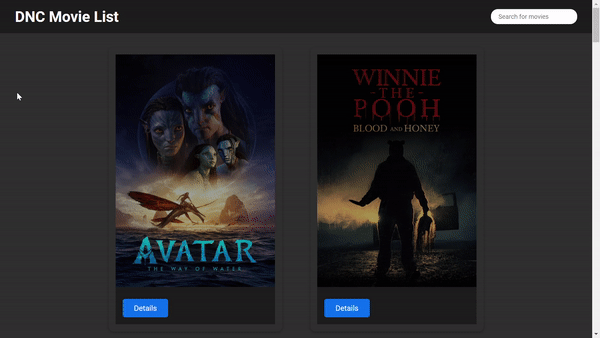

<h1 id="início">
  DNC Movie List
</h1>

DNC proposed the development of a web application to list movies using themoviedb API (TMDB).

## Index

* [1. About the project](#1-about-the-project)
* [2. Results](#2-results)
* [3. Getting started](#3-getting-started)
* [4. Technologies](#4-technologies)
* [5. Future implementation](#5-future-implementation)
* [6. Author](#6-author)

## 1. About the project

The Movie List application is a simple web application built using React.js that allows users to search for movies they have watched or want to watch. The application provides users with a user-friendly interface that allows them to easily filter the list to show only movoies related to the search word, and check movies details.

The application is built using a number of different technologies, including React.js, CSS, HTML, JavaScript, and NPM. It uses a number of different components to provide users with the functionality they need, including the App component, the Header component, and Card component.

The Movie List application is designed to be easy to use and easy to customize. It is open source, which means that anyone can contribute to it and make changes as needed. Whether you're a beginner looking to learn more about React.js or an experienced developer looking for a new project to work on, the Movie List application is a great place to start. 

For project planning, I used a trello tool to structure the activities that should be carried out by stages and their dependencies.

Main goals: 

   - Understand how a movie listing platform works.
  
   - Knowing how to use an API.

   - Knowing how to offer an intuitive and easy-to-use experience, based on your user's needs.
  
   - Knowing how to develop a project using the main front-end tools on the market: HTML, CSS, JavaScript and React.JS.
  
  

The _boilerplate_ was structured according to the features of the project and its components.

 The project was developed with **React and JavaScript**.

 ## 2. Results

Following the layout, I created the components as per the required topics.
The website is also responsive.
Check out how the app turned out below!

 

 

## 3. Getting started
You can also test and manipulate the project locally, just follow these steps:

To clone the project, open your terminal, type the following command below and hit enter:

      git clone https://github.com/edu-lauer/dnc-movie-list
  
That done, still in the terminal, enter the cloned folder and type the following command:

      npm install  
    

Now let's run the application! Type in the terminal:
        
      npm run dev
      

Ready! You can now use the project.    

## 4. Technologies

* [React](https://react.dev/)
* [JavaScript](https://www.javascript.com/)
* [Sass](https://sass-lang.com/)
* [JavaScript](https://developer.mozilla.org/pt-BR/docs/Web/JavaScript)
* HTML 5
* [Vite](https://vitejs.dev/)
* [React Router](https://reactrouter.com/en/main)
* Git e GitHub
* [Visual Studio Code](https://code.visualstudio.com/)

Overall, React is a great choice for building complex, dynamic, and scalable web applications. Its ease of use, efficient performance, and large community make it an excellent framework for both beginners and experienced developers alike.

Overall, Sass is a powerful tool for building maintainable, scalable, and efficient stylesheets. Its features and functionality make it a popular choice for web developers who want to streamline their CSS workflow and create more modular and reusable styles.

I chose to use Vite to start the project due to its agility and also **saves us a lot of time configuring other libraries**

  
## 5. Future implementation
      
In future implementations, for the improvement and performance of the project, I want to realize the following points:

  - Improved application performance.
  - Accessibility
  - Optimization and improvement in responsiveness.
  - Improvement in the issue of validations and error handling.

## 6. Author

👩‍💻 Project developed by:

  <table>
    <thead>
      <tr>
        <th align="center">Eduardo Lauer</th>
      </tr>
    </thead>
    <tbody>
      <tr>
        <td align="center">
          <a href="#">
             
          </a>
        </td>
      <tr>      
        <td align="center">
          
          
        </td>
       </tr>
    </tbody>
  </table>

  <a href="#início">
  ⬆ Back to the top
 </a>

